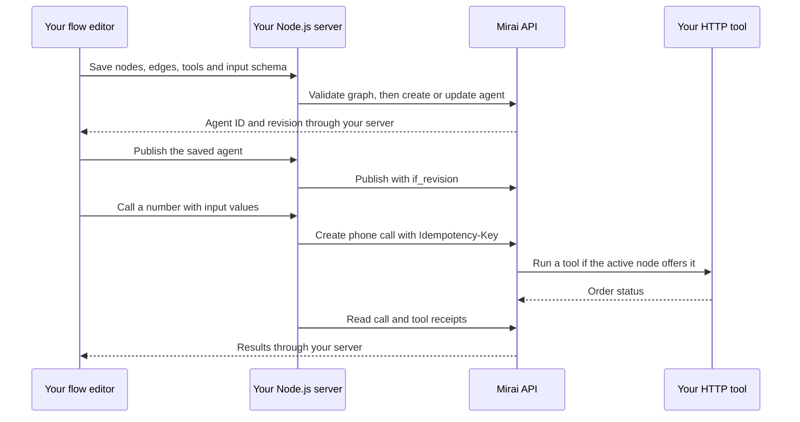

# Build a node based voice agent editor with Node.js

You can put a flow editor in your own product and save its graph directly on a
Mirai voice agent. Your users arrange conversation steps, write the conditions
between them, attach tools, and connect a phone number. Mirai runs the saved
conversation when a call starts.

The [example app on GitHub](https://github.com/MiraiMinds/node-flow-builder)
uses React Flow for the canvas and Express for the backend. It includes a
working local demo and a live mode that sends requests to your workspace.

## What you will build

The sample agent handles delivery questions. It greets the caller, moves to an
order lookup when help is needed, records whether follow-up is needed, and ends
the call. You can change the graph, save the same agent again, and place a call
using a specific saved revision.

You need Node.js 22.19 or later. Live mode also needs a workspace API key,
wallet credit for calls, and an active phone number for the phone steps. Use an
HTTPS endpoint you control for an HTTP tool. The included tool service returns
one fictional order so you can test the request format.

## Run the example

```bash
git clone https://github.com/MiraiMinds/node-flow-builder.git
cd node-flow-builder
npm ci
cp .env.example .env
npm run dev
```

Open `http://localhost:3000`. Demo mode works without a key and resets its
agents when the server restarts. It does not run speech, execute tools, contact
Mirai, or dial a number. Its call result is explicitly marked as sample data.

To connect your workspace, set these values in `.env` and restart:

```dotenv
MIRAI_MODE=live
MIRAI_API_KEY=your_workspace_key
MIRAI_BASE_URL=https://sandbox.voice.miraiminds.co
```

Use the API host your key was issued for. The key stays on the server. Do not
prefix it with `VITE_`, put it in localStorage, or send it to a browser.

## How the editor and API fit together



Your frontend owns selection, dragging, forms, and unsaved edits. The agent's
`flow` field holds the graph. Its `tools` and `input_schema` fields define what
the graph can use. There is no separate flow-agent creation endpoint.

The API calls below run on your server. The repository already has the client
in `server/mirai.js`; this wrapper makes its returned body easier to use in the
following snippets:

```js
import { createMiraiClient } from "./server/mirai.js";
import { example, exampleTool, exampleVariables } from "./shared/example.js";

const client = createMiraiClient({
  baseUrl: process.env.MIRAI_BASE_URL || "https://sandbox.voice.miraiminds.co",
  apiKey: process.env.MIRAI_API_KEY,
});
const api = async (method, path, body, key) =>
  (await client(method, `/v2${path}`, body, key)).body;
```

The client sends `Authorization: Bearer …`, preserves both API error shapes,
and makes one request per operation. It does not automatically retry writes.

## Step 1 Create the graph

A graph has `nodes` and `edges`. This is a complete, small example:

```js
const flow = {
  nodes: [
    {
      id: "hello",
      type: "startCall",
      position: { x: 0, y: 100 },
      data: {
        name: "Say hello",
        greeting: "Hello {{customer_name}}, how can I help with your delivery?",
        prompt:
          "Find out what delivery help the caller needs. Ask one question at a time.",
      },
    },
    {
      id: "delivery",
      type: "agentNode",
      position: { x: 360, y: 100 },
      data: {
        name: "Check delivery",
        prompt:
          "Ask for an order number. If lookup_order is available, use it and explain the returned status. Otherwise explain that a lookup is not configured. Never invent a status.",
        tools: [],
        extraction_enabled: true,
        extraction_variables: [
          {
            name: "needs_follow_up",
            type: "boolean",
            prompt: "True if the caller still needs help with the delivery.",
          },
        ],
      },
    },
    {
      id: "goodbye",
      type: "endCall",
      position: { x: 720, y: 100 },
      data: {
        name: "Finish",
        prompt: "Thank the caller and say goodbye briefly.",
      },
    },
  ],
  edges: [
    {
      id: "help",
      source: "hello",
      target: "delivery",
      data: {
        label: "check_delivery",
        condition: "The caller wants help with a delivery.",
      },
    },
    {
      id: "skip",
      source: "hello",
      target: "goodbye",
      data: {
        label: "finish_greeting",
        condition: "The caller needs no help or wants to end the call.",
      },
    },
    {
      id: "done",
      source: "delivery",
      target: "goodbye",
      data: {
        label: "finish_delivery",
        condition:
          "The question is answered, follow-up is needed, or the caller wants to stop.",
      },
    },
  ],
};
```

Each edge becomes a function the model can call. `data.label` is its function
name; `data.condition` tells the model when to use it. Conditions are plain
language, not JavaScript expressions. A node change keeps the conversation
history and replaces the current instructions and offered tools.

| Node type    | Purpose                                                                                   |
| ------------ | ----------------------------------------------------------------------------------------- |
| `startCall`  | Exactly one. Its `greeting` opens the conversation.                                       |
| `agentNode`  | A conversation step with its own instructions.                                            |
| `endCall`    | Speaks a closing reply, then ends the call. Has no outgoing edges.                        |
| `globalNode` | Optional shared instructions. Has no edges; used by nodes with `add_global_prompt: true`. |

Use 2–20 nodes and 1–40 edges, with a graph under 100 KB. Every conversation
node must be reachable from the start and have a path to an end. Node IDs and
transition labels use letters, digits, and underscores, with a letter or
underscore first. Use lowercase labels to avoid names that normalize alike.
The [graph reference](https://docs.miraiminds.co/v2/node-agents#the-graph)
lists the remaining field limits.

React Flow adds fields such as `selected`, `measured`, and handle IDs. Strip
them when saving, as `shared/graph.js` does:

```js
const toApiGraph = (nodes, edges) => ({
  nodes: nodes.map(({ id, type, position, data }) => ({
    id,
    type,
    position,
    data,
  })),
  edges: edges.map(({ id, source, target, data }) => ({
    id,
    source,
    target,
    data,
  })),
});
```

Keep positions so reopening an agent restores its layout. Keep canvas state
separate from your API payload; React Flow's `type: 'smoothstep'` is a drawing
choice, not the conversation's condition.

## Step 2 Validate and create the agent

```js
const validation = await api("POST", "/agents/flow/validate", flow);
// { ok: true, flow_revision: "…", nodes: 3, edges: 3 }

let agent = await api("POST", "/agents", {
  name: "Delivery check-in",
  language: "en",
  voice: { voice_id: "neha", language: "en" },
  draft: true,
  input_schema: example.input_schema,
  tools: [],
  flow,
});
console.log(agent.id, agent.revision);
```

`POST /agents/flow/validate` takes the graph directly, without a `{ flow: … }`
wrapper. It checks graph rules and model compatibility without saving or
calling. Agent creation also checks input declarations and tool references.

Flow agents use their start node's greeting and node prompts. You do not need
`system_prompt` or `first_message`. Query `GET /v2/voices` for voice IDs your
deployment offers. This recipe creates a draft so phone calls wait until you
publish it.

You can also create the JSON exported from the app with cURL:

```bash
curl --fail-with-body "$MIRAI_BASE_URL/v2/agents" \
  -H "Authorization: Bearer $MIRAI_API_KEY" \
  -H 'Content-Type: application/json' \
  --data-binary @mirai-agent.json
```

## Step 3 Update the same agent without overwriting someone else's edit

Store the returned agent ID and numeric `revision`. Send that revision as
`if_revision` on your next update:

```js
const editedFlow = structuredClone(agent.flow);
editedFlow.nodes.find((node) => node.id === "delivery").data.prompt +=
  " Repeat the order number back before looking it up.";

agent = await api("PATCH", `/agents/${agent.id}`, {
  if_revision: agent.revision,
  flow: editedFlow,
});
```

When you edit tools, inputs, and the graph together, send them in one PATCH.
This lets the API validate the resulting configuration together. The `tools`
array and nested configuration blocks replace their previous values; send the
complete list or block, including entries you want to keep.

For an editor that changes only the graph, use the dedicated routes:

```js
const view = await api("GET", `/agents/${agent.id}/flow`);
// view.agent_revision is numeric; view.flow_revision is a graph hash.
agent = await api(
  "PUT",
  `/agents/${agent.id}/flow?if_revision=${view.agent_revision}`,
  view.flow,
);
```

Use `agent_revision`, never the graph hash, for the write precondition. A
`409 conflict` means your copy is stale. Keep the local edits, fetch the current
agent, show the difference, and let the user reconcile it. Do not automatically
resend the old graph with a newly fetched revision. The example keeps your
edits on failure and lets you export them before reloading.

After a lost response, read the agent before another write: the first request
may have succeeded. If creation had no confirmed response, inspect the agent
list before creating again.

## Step 4 Add a tool and offer it on one node

Tool definitions belong to the agent. A node carries only their names in
`data.tools`. The delivery step can offer `lookup_order` while the greeting
step offers only its transitions.

First provide an HTTPS endpoint. To try the repository's sample endpoint, put
a random `TOOL_SHARED_SECRET` of at least 24 characters in `.env`, then run
`npm run tools`. Expose port 3001 through an HTTPS tunnel on port 443. Keep the
editor on port 3000 private to your machine. The sample returns delivery data
only for `DEMO-1042`; adapt `server/tool-service.js` to query your database.

Save the same secret in Mirai from your backend:

```js
await api("PUT", "/secrets/order_service_token", {
  value: process.env.TOOL_SHARED_SECRET,
});

const lookupOrder = structuredClone(exampleTool);
lookupOrder.request.url =
  "https://your-public-tool-host.example/tools/lookup-order";
lookupOrder.request.headers = {
  Authorization: "Bearer {{ secrets.order_service_token }}",
};

const withTool = structuredClone(agent.flow);
withTool.nodes.find((node) => node.id === "delivery").data.tools = [
  "lookup_order",
];
agent = await api("PATCH", `/agents/${agent.id}`, {
  if_revision: agent.revision,
  tools: [
    ...agent.tools.filter((tool) => tool.name !== "lookup_order"),
    lookupOrder,
  ],
  flow: withTool,
});
```

Replace the sample hostname before saving. The definition in
`shared/example.js` declares an `order_id` argument and sends it as
`{{ args.order_id }}` in an HTTP POST body. Its `when` rule tells the model to
wait until the caller provides or confirms that number. `speak_while` supplies
the line spoken during the request.

Use `{{ secrets.name }}` in a header instead of embedding the credential in
the tool JSON. Tool URLs must satisfy the API's outbound-request rules;
localhost and private network URLs are not reachable tool destinations.

| Tool phase  | Where it runs                                                                     |
| ----------- | --------------------------------------------------------------------------------- |
| `pre_call`  | Before the conversation, for work such as fetching customer context.              |
| `on_call`   | During the conversation, when offered by the active node and chosen by the model. |
| `post_call` | After the call, for work such as writing the outcome to your CRM.                 |

Only start and conversation nodes can offer on-call tools, up to ten names
per node. Each name must refer to this agent's `on_call` definition. Disabled
tools are not offered. Tool names cannot collide with transition labels
anywhere in the graph. Keep `end_call` disabled or absent: a flow ends at an
`endCall` node.

You can test the saved HTTP request without making a phone call:

```js
const receipt = await api(
  "POST",
  `/agents/${agent.id}/tools/lookup_order/test`,
  {
    vars: exampleVariables,
    args: { order_id: "DEMO-1042" },
  },
);
console.log(receipt);
```

This executes your real endpoint. A tool that writes to a CRM would perform
that write during a test too. The app's demo mode does not execute this request.
See the [tools reference](https://docs.miraiminds.co/v2/tools) for conditions,
response transforms, asynchronous execution, and receipts.

## Step 5 Separate call inputs from extracted values

Inputs are facts your application knows before the call: a customer's name,
an order number, or a preferred language. Declare them in `input_schema` and
send typed values in the call's `variables` object.

```js
agent = await api("PATCH", `/agents/${agent.id}`, {
  if_revision: agent.revision,
  input_schema: {
    type: "object",
    properties: {
      customer_name: { type: "string", default: "there" },
      order_id: { type: "string", default: "" },
    },
    additionalProperties: false,
  },
});

const variables = { customer_name: "Sam", order_id: "DEMO-1042" };
const preview = await api("POST", `/agents/${agent.id}/preview`, { variables });
console.log(preview.variables);
```

Use `{{customer_name}}` in node prompts and greetings. HTTP tools use explicit
namespaces such as `{{ vars.customer_name }}` and `{{ args.order_id }}`.
Edge conditions do not interpolate variables. When an input schema is present,
declare each input your node text references.

Extraction collects facts from what the caller says. In the sample,
`needs_follow_up` is a boolean extracted when the delivery node is left. Its
definition lives in `data.extraction_variables`, with
`data.extraction_enabled: true`. It is not a required call input.

Extraction runs in the background, so do not depend on its result being ready
for the next node's opening line. Use the conversation history to continue
the call and inspect the final extracted values in its results.

For incoming phone calls, your application cannot supply a fresh variables
object with each ring. Use input defaults, ask the caller for missing facts,
or fetch context with a pre-call tool. Required inputs without defaults can
prevent inbound admission. The sample defaults the name to `there` and the
order number to an empty string.

## Step 6 Publish the saved revision

```js
agent = await api("POST", `/agents/${agent.id}/publish`, {
  if_revision: agent.revision,
});
console.log(agent.revision, agent.draft); // new revision, false
```

An agent has one current configuration. Publishing saves a new non-draft
revision. Saving edits to a published agent changes what new ordinary direct
calls use. Setting it back to draft pauses ordinary direct call admission;
there is no separate published copy that stays active behind it.

Already accepted calls keep their snapshots. For a substantial redesign of a
busy agent, create a separate agent, test it, and switch your platform's agent
mapping or number assignment when ready. The
[agent guide](https://docs.miraiminds.co/v2/agents) covers revision history and
rollback, which creates a new draft revision.

## Step 7 Connect a phone number

If your deployment enables its default calling route, you can select
**Platform default** in the app and skip number setup. Send `channel: "phone"`
and `to` without `phone_number_id`; Mirai chooses the outgoing number.
This is the route used by Console's agent dialer. Availability depends on your
deployment: a disabled route returns `trunk_unavailable`; deployments requiring
verified test calls return `phone_verification_required` and need the dedicated
test-call endpoint or a workspace number. The app displays that API error.

To choose an outgoing number yourself or assign an inbound agent, use a
workspace number as described below.

If you already have an active workspace number, list it and skip provider
setup:

```js
const page = await api("GET", "/phone-numbers");
console.log(page.data);
// Follow page.next_cursor when page.has_more is true.
```

To bring a number from your Plivo account, the provider import sequence is:

```js
const integration = await api("POST", "/telephony/connections", {
  provider: "plivo",
  name: "Delivery support",
  auth_id: process.env.PLIVO_AUTH_ID,
  auth_token: process.env.PLIVO_AUTH_TOKEN,
});
const inventory = await api(
  "GET",
  `/telephony/connections/${integration.id}/numbers`,
);
console.log(inventory.data);

// Use a number returned by that inventory, in E.164 format.
let number = await api("POST", "/phone-numbers", {
  connection_id: integration.id,
  number: process.env.PLIVO_NUMBER,
});
```

Creation verifies the provider credentials. Number import requires a verified
integration and ownership of that number. These credentials stay on your
backend. The local app starts with imported workspace numbers; it does not
collect Plivo credentials or purchase numbers. Provider features and number
availability depend on your deployment and workspace setup. Inspect
`GET /v2/telephony/options` before offering onboarding in your own product.

Assign the published agent for inbound calls, then activate the number if it
is not already ready and verified:

```js
// Or fetch an existing number: GET /v2/phone-numbers/{id}.
number = await api("PATCH", `/phone-numbers/${number.id}`, {
  version: number.version,
  agent_id: agent.id,
});

if (number.state !== "ready" || number.connection_state !== "verified") {
  number = await api("POST", `/phone-numbers/${number.id}/activate`, {
    version: number.version,
    replace_existing_application: false,
  });
}
```

Phone numbers use `version`; agents use `if_revision`. Read and retain each
response before the next operation. Activation configures the provider's
voice application. If another application is already attached, stop and review
that assignment before explicitly requesting a replacement. The example
always sends `replace_existing_application: false`.

Inbound assignment makes incoming calls to that number use this agent. For
outbound calls, the request explicitly chooses both the agent and the number.
You can leave an existing inbound assignment in place when testing outbound
calls. The number must have `state: "ready"` and `connection_state: "verified"`.

## Step 8 Place the call and inspect its result

Use your own test phone and confirm that the recipient expects the call. This
request rings the destination and consumes wallet credit; `test: true` is not
supported for phone calls.

```js
const callBody = {
  agent_id: agent.id,
  agent_revision: agent.revision,
  phone_number_id: number.id, // Omit for the platform default route.
  channel: "phone",
  to: process.env.TEST_PHONE_NUMBER,
  variables,
  max_duration_secs: 120,
  recording_enabled: false,
  final_results: true,
};

// Persist both values BEFORE sending in a hosted application.
const idempotencyKey = crypto.randomUUID();
const call = await api("POST", "/calls", callBody, idempotencyKey);
console.log(call.id, call.status);

const result = await api("GET", `/calls/${call.id}`);
const toolRuns = await api("GET", `/calls/${call.id}/tool_runs`);
console.log(result.status, result.flow, toolRuns.data);
```

Creating a call returns an ID, not a completed conversation. Refresh the call
until it reaches a terminal status; results may arrive after it ends. A flow
result includes `nodes_visited` and extracted `variables`, plus `final_node`
when a node was reached. Use the call's `agent_revision` to identify its saved
configuration. Inspect tool receipts separately to see what actually ran.

If a call request loses its response, retry the same body with the same
idempotency key. A new key can create a second call. The app saves an unresolved
attempt in tab-scoped sessionStorage and offers **Retry the same request**.
Keep these records in your backend database in a hosted product.

`first_message` overrides are refused for flows. Personalize the start node's
greeting through variables. A flow needs voice: text-only calls are not
supported. To add browser audio, follow the
[browser calls guide](https://docs.miraiminds.co/v2/web-calls). For a server
notification when final results are ready, add a `webhook_url`, keep
`final_results: true`, and verify the signed `call.processed` event as described
in the [webhook guide](https://docs.miraiminds.co/v2/webhooks).

## Test it

Run `npm run check` for local API-boundary tests and a production build. In
demo mode, create the agent, edit and save it, publish it, assign the demo
number, then create a demo call. Restart the server to see the empty workspace
behavior. Demo calls do not test conversation quality or provider routing.

Before using a live number, validate and save the graph, preview its inputs,
and test the order tool against the sample order. On your test call, ask for a
delivery update, provide the order ID, then end the conversation. Check the
visited nodes, extraction, and tool receipts. Make another call that needs no
help to exercise the direct path to the end node.

| Symptom                                         | What to check                                                                                                 |
| ----------------------------------------------- | ------------------------------------------------------------------------------------------------------------- |
| `invalid_flow` with `details`                   | Show each `path` and `message`. Check reachability, end paths, node tool names, and transition labels.        |
| Graph validation passes, but saving fails       | Agent save also checks tool definitions and declared inputs.                                                  |
| `409 conflict` on save                          | Keep local work, load the current revision, and reconcile the edits.                                          |
| The tool is never offered                       | It must be an enabled `on_call` tool listed in the current node's `data.tools`; check any tool condition too. |
| Tool HTTP request fails                         | Check the public HTTPS URL, secret reference, request arguments, and tool receipt.                            |
| Phone number is not ready                       | Verify the provider integration, activate the number, and refresh its state.                                  |
| Inbound calls cannot start                      | Check the published agent, number assignment, wallet, and defaults for required inputs.                       |
| A call returns 402                              | Check the workspace wallet and the API's error message.                                                       |
| API returns 429                                 | Honor `Retry-After`; preserve the original call key when retrying.                                            |
| API host returns 404 for a documented operation | Check the configured host and whether that feature is available on your deployment.                           |

The example has not verified your workspace's live credentials, provider
configuration, or audio. Complete the live checks with your test number before
giving the flow to customers.

## Put the editor in your platform

The sample is a local, single-workspace app. Its loopback and same-origin guards
are appropriate for that setup. A hosted product needs authenticated sessions,
workspace ownership checks on every agent, call and number, CSRF protection,
and rate limits. Derive the workspace and its key from the signed-in user on
your server. Do not accept arbitrary API hosts or workspace keys from the page.

Store unsaved drafts and call attempts in your own database. Keep the API
revision with each editor session, and treat an unresolved write as unresolved
until you read it back. Add request limits and role checks around phone
activation, assignment, publication, and calls.

Call inputs, transcripts, tool receipts, and exported JSON can contain customer
information. Apply your product's access and retention policies. This sample
disables call recording, but that does not turn off transcripts or stored call
results. Follow the calling, consent, and recording requirements that apply to
your use case; see the [limits guide](https://docs.miraiminds.co/v2/limits).

Start by adapting `shared/example.js` and the forms in `src/main.jsx`. Keep
the server boundary and revision handling when you move the editor into your
application. The [full source](https://github.com/MiraiMinds/node-flow-builder)
includes the sample tool, error handling, and tests.
